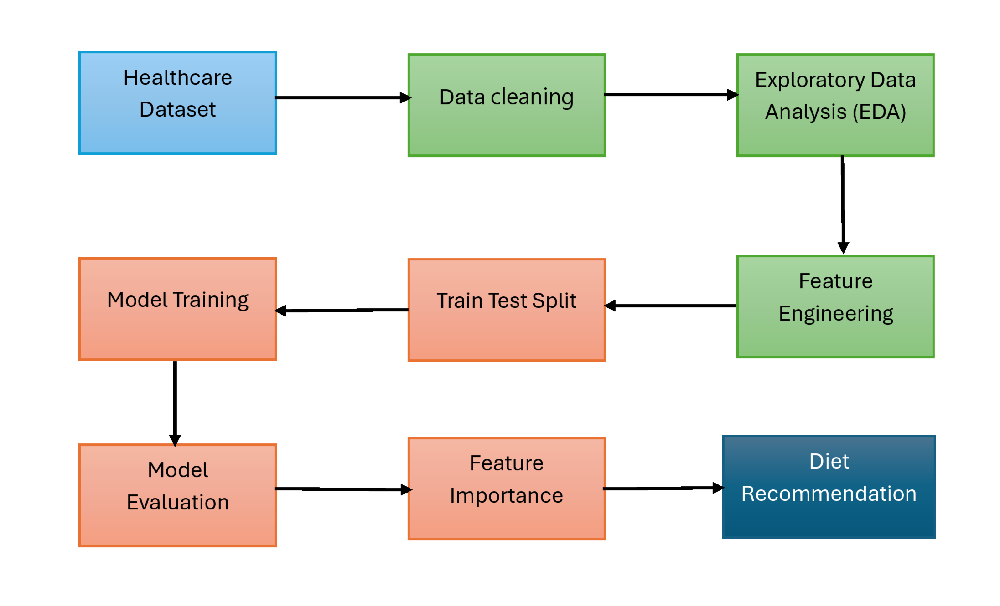
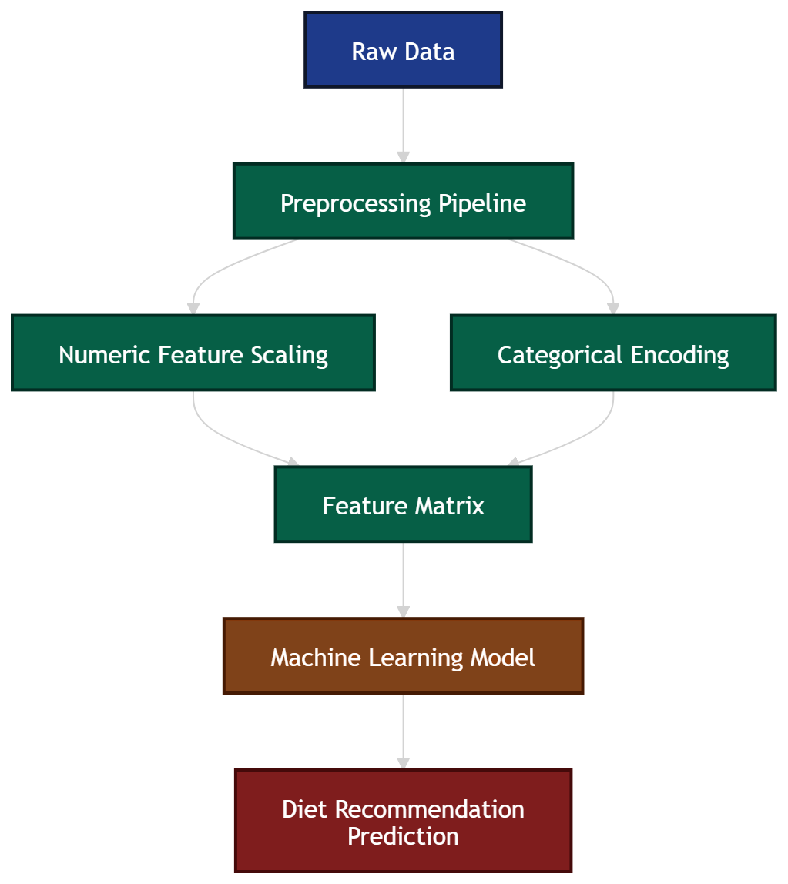
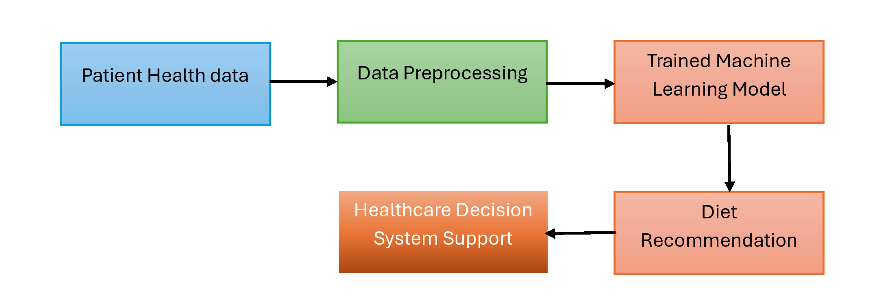

# Healthy Diet Recommendation System

A machine learning project that predicts personalized diet recommendations based on patient health indicators such as BMI, cholesterol levels, and other clinical attributes. The project demonstrates a complete data science workflow including data exploration, preprocessing, model training, and evaluation.

# Problem Statement

Healthcare providers often need to recommend suitable diet plans based on a patient's medical profile. Making these recommendations consistently and quickly can be challenging.

The objective of this project is to build a machine learning model that predicts appropriate diet recommendations using patient health data.

## Business Understanding

A predictive system like this can help:
- Provide quick preliminary diet suggestions
- Support healthcare professionals with data-driven decisions
- Enable scalable personalized healthcare recommendations

Such models could eventually be integrated into health monitoring platforms or hospital decision-support systems.

## Dataset Description

The dataset contains health-related attributes for individuals.

Example features include:
- Age
- BMI
- Cholesterol
- Blood sugar indicators
- Health risk indicators
- Insurance cost estimates
  
Target variable:
- Diet_Recommendation
  
Possible diet types:
- Balanced Diet
- Low Carb
- High Protein
- Plant Based

## Project Workflow

The project follows a standard machine learning pipeline:  
1️. Data Understanding  
2️. Data Cleaning  
3️. Exploratory Data Analysis  
4️. Feature Engineering  
5️. Train-Test Split  
6️. Model Training  
7️. Model Evaluation  
8️. Hyperparameter Tuning  
9️. Feature Importance Analysis  

## Exploratory Data Analysis

EDA was conducted to understand the dataset and identify relationships between features.

Key analyses include:
- Age distribution
- BMI distribution
- Target class balance
- BMI vs diet recommendation
These analyses help identify patterns that may influence diet recommendations.

## Feature Engineering

Feature preprocessing was implemented using Scikit-learn pipelines to avoid data leakage.

Steps included:
- Separating numerical and categorical features
- Scaling numeric features using StandardScaler
- Encoding categorical variables using OneHotEncoder
- Combining transformations with ColumnTransformer

## Modeling

Two classification models were implemented:
- Logistic Regression
   - Used as a baseline model
   - Interpretable and computationally efficient
- Random Forest
   - Captures nonlinear relationships
   - Often performs better on tabular data

Hyperparameter tuning was performed using GridSearchCV with StratifiedKFold cross-validation.

## Results

The tuned Random Forest model achieved the best performance based on:
- Accuracy
- Macro F1-score

Feature importance analysis revealed that variables such as:
- Cholesterol
- HbA1c
- Predicted Insurance Cost
play significant roles in determining diet recommendations.

## Key Visualizations

The following visualizations were used to explore the data:

- Age distribution
- Target class distribution
- BMI distribution
- BMI vs Diet Recommendation
- Feature importance

## Technologies Used
- Python
- Pandas
- NumPy
- Scikit-learn
- Matplotlib
- Seaborn

## Project Workflow Diagram

  
  
## Machine Learning Pipeline Diagram

## System Architecture Diagram

